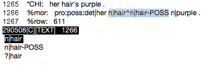

.. _mg-steps:

**********************
The Annotation Process
**********************

If you have everything set up as outlined in the :ref:`Setup section <mg-setup>`, you can start coding syntax.  This section outlines the syntax coding process, from acquiring a transcript to cleaning it up for analysis to resubmitting the fully coded transcript in the SVN repository.  There are many steps, so you will probably have to refer back to this document fairly often for the first few transcripts.

.. _mg-steps-1:

1. Navigate to your working directory
=====================================

Each syntax coder should have their own directory in the **morphosyntax**
repository, in the folder *$REPO/chat/proj_(2|3)/coders*, depending on which
project you are working on.  Navigate to this directory in Terminal using the
``cd`` command.

For example, if Max is working on Project 2 syntax, he would type::

    cd $REPO/chat/proj_2/coders/max

If Natalie is working on Project 3 syntax, she would type::

    cd $REPO/chat/proj_3/coders/natalie

.. note::

    1. If you do not yet have a personal working directory, ask Jason to set one up for you.
    2. If you are training, it may be helpful to add another folder to your working directory where you can just practice.  For example, to add a folder called *training*, type ``mkdir training`` in the Terminal when you are in your working directory.  Then you can ``cd`` to training.

.. _mg-steps-2:

2. Use dump.py to generate the CHAT file
========================================

Use the *dump.py* tool included in the code repo to generate the CHAT file for
the transcript you are working on.  This program requires three arguments:
*--subject*, *--session*, *--out*.  When you're in your working directory,
simply type::

    dump.py --subject SUBJ_NUM --session SESS_NUM --out OUT_FILE

replacing SUBJ_NUM and SESS_NUM with the subject and session number you're
working on, and OUT_FILE with a filename following the format
SUBJ_NUM.SESS_NUM.cha.

For example, to create a CHAT file for subject 29, session 9, type::

    dump.py --subject 29 --session 9 --out 29.09.cha

.. _mg-steps-3:

3. Clean up the file for morphosyntactic analysis
=================================================

The file must be prepped before any of the software can be run on it.  See the section on :ref:`Prepping a Transcript <mg-clean>` for detailed instructions on this step.

.. note::

	The entire :ref:`Prepping a Transcript <mg-clean>` section must be completed before proceeding to the next step.

.. _mg-steps-4:

4. Reconcile words not found in the CLAN lexicon
================================================

After you remove disfluencies and repetitions, there may be words in the transcript that CLAN does not recognize for whatever reason.  To find these words, type::

	mor +xl 123.09.cha

This will generate a file called *123.09.ulx.cex*.  Search *123.09.cha* for the words found in *123.09.ulx.cex* and take one of the following steps to correct it:

.. _mg-steps-4-1:

4.1. Spelling errors
--------------------

If a word cannot be found in the CLAN lexicon and it doesn't appear to be a compound word, check to see if it is misspelled.  Two resources are the `Oxford English Dictionary <http://www.oed.com>`_ and the terminal command **dic**, which searches the CLAN lexicon files on your computer.  If the word is misspelled, simply correct the spelling in the transcript.

For help on the **dic** command, simply type *dic* into the terminal and press Enter.

.. _mg-steps-4-2:

4.2. Compound words
-------------------

If the unrecognized word appears to be a compound word but is written as one word (for example, ``icecream``), see if there is an entry for a compounded form (for example, ``ice+cream``) using the **dic** command.  If there is, replace it with the compounded form.  You may need to search for individual components of the word to find a compounded form.  For instance, if a transcript contains ``upsidedown`` and nothing comes up when you type *dic upsidedown*, try typing *dic down*.  Alternatively, you can use the -p switch to search for part of a word (for example, *dic -p side*).

If, however, you have searched for each component and there is no compounded form of the word you're looking for, you may have to add a new entry to the appropriate lexicon file.  See :ref:`Section 4.5 <mg-steps-4-5>` for information on adding new words to the lexicon.

.. _mg-steps-4-3:

4.3. Numbers
------------

Numbers are written with a ``+`` between each element of the number.  A number can be made up of cardinal numbers (``one``, ``twenty+two``, ``seventy+three``, etc.), ordinal numbers (``first``, ``twenty+seventh``, ``ninety+fourth``, etc.), fractions (``one+half``, ``three+quarters``, ``five+ninths``, etc), and the words ``and``, ``a``, and ``oh``, meaning zero (``five+and+a+half``, ``eight+oh+eight``, ``one+hundred+and+eighty+first``).

.. seealso::

	:ref:`Section 6.9 <tg-6-9>` of the Transcription Guide explains the conventions for transcribing numbers.

.. _mg-steps-4-4:

4.4. Applying the ``&`` and ``@`` symbols to non-words or idiomatic words
=========================================================================

If CLAN does not recognize a word, you may want to apply either the ``&`` or the ``@`` symbol instead of adding it to the lexicon.

If you feel that something should not be counted as a word (for example, "the plane went phwoom past the tower"), place the ``&`` symbol *in front of* the word (``the plane went &phwoom past the tower``).  This symbol will prevent the attached word from being included in word counts and morphosyntactic analysis.

If, however, you feel that the unrecognized word is being used as a word, but is not common enough to justify adding it to the CLAN lexicon (for example, "did you frump?" where "frump" means "fart"), place the ``@`` symbol *at the end of* the word (``did you frump@ ?``).  This symbol will include the attached word in word counts and morphosyntactic analysis, but will assign it the part-of-speech ``idio``.

.. seealso::

	:ref:`Section 6.1 <tg-6-1>` of the transcription guide explains when and how to use the ``&`` and ``@`` symbols.

.. _mg-steps-4-5:

4.5. Adding words to the CLAN lexicon
-------------------------------------

If you find a word that is not recognized in the CLAN lexicon and that can not be made to match an entry in the CLAN lexicon (by changing the spelling or by compounding, for instance), you will have to add that word to the lexicon in the SVN repository.

Open the appropriate lex file by typing::

		add ldp-filename.cut

where *filename* is derived from the part of speech for the word you are adding.  For simple parts-of-speech, this is just the part-of-speech code.  If you are adding a new noun or a new adverb, for instance, type::

		add ldp-n.cut
	or	add ldp-adv.cut

For more specific parts-of-speech that have a colon in the tag (e.g. ``adv:int`` or ``pro:poss:det``), it will be the code for the base part-of-speech.  For a new ``adv:int`` or ``pro:poss:det``, for instance, you would type::

		add ldp-adv.cut
	or	add ldp-pro.cut

For compound words, the filename is made up of two parts: the part-of-speech of the entire compound, and the parts-of-speech of the components, joined together with ``+`` signs.  For instance, the part-of-speech of ``ice+cream`` is ``n``, and the parts-of-speech of the two components are ``n`` and ``n``.  The filename, then, would be *n+n+n*, which would be plugged into the command as::

		add ldp-n+n+n.cut

Similarly, if you were adding an entry for ``blind+fold`` (part-of-speech: ``v``; components: ``adj+v``) or ``blast+off`` (part-of-speech: ``n``; components: ``v+ptl``) the filenames would be *v+adj+v* and *n+v+ptl*, so you would type::

		add ldp-v+adj+v.cut
	or	add ldp-n+v+ptl.cut

This command will open the file where you need to add an entry.  A lexical entry has the following format::

	word {[scat pos] ([comp pos+pos]) }

where ``word`` is the word to be added and ``pos`` is the part-of-speech.  The ``[comp pos+pos]`` entry is only for compounded words, where ``pos+pos`` is the part-of-speech of each component of the compound, separated by ``+`` signs.  For example, if you were adding the word "made+up" to the file *ldp-adj+v+ptl.cut*, you would add the following to the end of the file::

	made+up {[scat adj][comp v+ptl]}

When you have added the entry, save and close the file.  When there are no more words to be added to the lexicon, commit the modified files to the SVN repository.  You may do this by navigating to the **morphosyntax/clan/lib/english/lex/** directory and typing ``svn commit -m'Message here'``, or simply by typing ``commitlex`` from your current location.

.. _mg-steps-5:

5. Run MOR to generate a *.mor.cex* file
========================================

Generate the *.mor.cex* file for your transcript by typing::

	mor 123.09.cha

This will generate the file *123.09.mor.cex*.

.. note::

	Only the original raw transcript files have the *.cha* file ending.  When you run MOR and all subsequent programs, the file ending will be *.cex*.

.. _mg-steps-6:

6. Run the automatic part-of-speech disambiguator POST
======================================================

Automatically disambiguate (most of) the transcript by typing::

	postal 123.09.mor.cex

This will generate the file *123.09.pst.cex*, in which all but the most ambiguous words are resolved.

.. _mg-steps-7:

7. Manually disambiguate the remaining ambiguous words in the *.pst.cex* file
=============================================================================

Open the newly created *.pst.cex* file by typing::

	open 123.09.pst.cex

This will open the file in the CLAN Graphical User Interface.  Manually disambiguate the remaining ambiguous words by going to the menu and choosing Mode->Disambiguate Tier, or by pressing Esc-2.  This will put you into disambiguation mode.  To use disambiguation mode:

	* Use the arrow keys to select choices for the ambiguous word at the bottom of the screen.
	* When you have the correct choice selected, press Enter.
	* If you do not see the correct choice, select the last one **?|word** and manually enter the correct part-of-speech and any clitics that may be attached.  For example, if you see the following:

you will notice that neither option is correct, as **hair's** is not a possessive but rather a contraction of **hair is**.  You must then select **?|hair** and enter the correct part-of-speech and clitic, in this case **n|hair~v|be&3S**.

	* If there were any words that were not recognized when :ref:`reconciling with the CLAN lexicon <mg-steps-4>` (because of unusual derivations or inflections like "stoled", for instance), search for **?|** and manually enter the correct part-of-speech.

.. _mg-steps-8:

8. Generate the syntax tier with GRASP
======================================

When there are no more ambiguous entries (i.e. no words with part-of-speech code **?** and no words separated by the **^** symbol), you can generate the syntax tier by typing::

	grasp -p mor -g syn -o 123.09.syn.cex 123.09.pst.cex

where the *-p mor* switch specifies the tier with part-of-speech information to read in, the *-g syn* switch specifies the name of the syntax tier to be created, and the *-o 123.09.syn.cex* switch specifies the name of the file which will be created.

.. _mg-steps-9:

9. Run *fixlines* on the newly created syntax file
==================================================

The GRASP program sometimes splits lines up, which gives other programs problems when trying to read the file.  To correct this, type::

	fixlines 123.09.syn.cex

.. _mg-steps-10:

10. Flag potentially incorrectly coded utterances with graspParse.py
====================================================================

Flag incorrectly coded utterances in the newly created syntax-coded transcript by typing::

	flag -g %syn: -f 123.09.syn.cex > 123.09.flags.cex

where *-g %syn:* specifies the name of the syntax tier and *-f 123.09.syn.cex* specifies the file to be read in.  The last part, *> 123.09.flags.cex*, redirects the output to a file called *123.09.flags.cex*, instead of the default output, which is simply to the screen.

.. _mg-steps-11:

11. Search for flags and correct any problems
=============================================

Open the newly created *.flags.cex* file in the VI editor.  Search for flags (denoted by *==== flag description ====*) and correct the corresponding utterances.  You can easily count the number of remaining flags in VI by typing the key combination *mct* and you can find the next flag by hitting *==* (and thereafter you can hit *n* to find the next flag).

Use the :ref:`Section on Common Problems <mg-problems>` as a guide to correcting the flagged morphology and syntax tiers.

Also, the :ref:`Section on Flag Names <mg-flags>` explains what each flag rule name means and what you should look for if it comes up.

.. seealso::

	:ref:`VI Shortcuts <mg-shortcuts>`
		A list of shortcuts that will make syntax coding much faster and easier.
	:ref:`Common Problems in Syntax Coding <mg-problems>`
		Common problems you may encounter while correcting syntax transcripts and how to resolve them.
	`VI for Smarties <http://www.jerrywang.net/vi/>`_
		A short and simple tutorial on the basics of using the VI text editor.
	`Mastering the VI Editor <http://www.eng.hawaii.edu/Tutor/vi.html>`_
		A longer, more detailed tutorial on the VI text editor.

.. _mg-steps-12:

12. Commit the corrected syntax-coded transcript back into the SVN repository
=============================================================================

After you have run the flagger and corrected all of the flagged utterances, place the completed syntax-coded transcript in the SVN repository.  First, copy it to the appropriate directory by typing::

	cp 123.09.flags.cex $CLAN/unix/ldp/morphosyntax/proj_(2|3)/final/syntax/chat/##H/123.09.syn.cex

where *proj_(2|3)* specifies the project number (e.g. *proj_2*) and *##H* is the visit session number (e.g. *09H*).  Notice that the target has the *.syn.cex* file ending.  We want all transcripts committed to the SVN repository to end with *.syn.cex* and NOT *.flags.cex*.

Now navigate to the directory that you moved the transcript to and commit the file to the svn repository by typing::

	svn add 123.09.syn.cex
	svn commit -m'Brief message about what you are committing'

