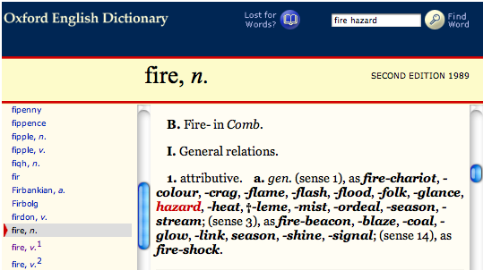
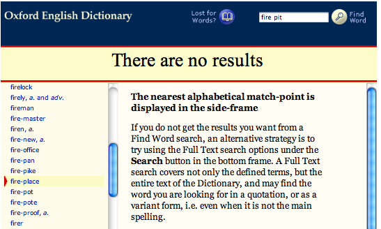

.. _tg-faq:

*****************************************
Frequently Asked Questions: Transcription
*****************************************

1. Should I transcribe a sibling speaking to the subject child?
===============================================================

No.  The only people whose speech you transcribe are the subject child, the primary caregiver(s), and (during literacy visits only) the experimenter.

.. _tg-faq-2:

2. How often do I need to place the ``---`` symbol when a PCG is talking to someone other than children?
========================================================================================================

Use the ``---`` symbol only once when the PCG begins speaking to a non-child entity.  Place the symbol again *only if* the PCG speaks to the child and resumes speaking to the other entity.

.. seealso:: :ref:`Section 2.3.1 <tg-2-3-1>`.

.. _tg-faq-3:

3. Somebody adds a short phrase to the beginning or end of the utterance.  Should I transcribe these on the same line?
======================================================================================================================

It depends on what the phrase is.  If the phrase is a complete sentence itself, transcribe it on a separate line.  To qualify as a complete sentence it must have a verb and either a subject or an object (for example, "know what" or "you see").  See :ref:`Section 4.7 <tg-4-7>` and :ref:`4.9.3 <tg-4-9-3>`.

The exception to this rule is inverted auxiliary tag questions (for example, 
"you want some food, **don't you**"), which should be transcribed on the same 
line.

.. seealso:: :ref:`Section 4.9.2 <tg-4-9-2>`.

.. _tg-faq-4:

4. The child and the PCG start talking at the same time.  Who do I transcribe first?
====================================================================================

First, listen closely to determine if the two speakers really do start talking at the same time.  If one starts even slightly before the other, transcribe that person first.

If the two start speaking at the exact same time, transcribe the utterances on separate lines in the following order:

	* Experimenter (for literacy visits only)
	* Mother
	* Father
	* Child

.. seealso:: :ref:`Section 3.3 <tg-3-3>`

.. _tg-faq-5:

5. When do I use the ``+`` or the ``_`` symbols?
================================================

The ``+`` symbol is primarily used to form compound words, proper nouns, and titles considered to be one lexical unit, as defined in :ref:`Section 6.5 <tg-6-5>`. It is also used for abbreviations (*t+v*, *d+v+d*), foreign phrases used as fixed expressions (*cul+de+sac*, *non+sequitur*), catch phrases (*yabba+dabba+doo*), and a few fixed phrases (*kind+of*, *how+about*).

The ``_`` symbol is primarily used to join words in multiple word proper nouns and titles (e.g. *The_Cat_In_The_Hat*) considered to be more than one lexical unit, as outlined in :ref:`Section 6.6 <tg-6-6>`.  

The ``+`` symbol and ``_`` symbol can be combined when appropriate (*Toy+Story_Two*, *Jackass_Three+D*).

.. seealso:: See the list of :ref:`Spelling Conventions <tg-spelling>` for more examples of how to use the ``+`` and ``_`` symbols.

.. _tg-faq-6:

6. How should I spell this word?
================================

While transcribing a visit, you may encounter words whose spelling you are 
unsure of.  For most normal words, we simply use standard American spelling 
found in any American dictionary.  

For a list of conventional spellings of non-word communicative sounds and words not found in the dictionary, consult the :ref:`list of standardized spellings <tg-spelling>`.

To decide whether a word is a compound, use the `Oxford English Dictionary <http://www.oed.com>`_.  See :ref:`Q7 <tg-faq-7>` for more.

To decide whether to use a *-y* or *-ie* suffix for a word like *ducky/duckie*, see :ref:`Q8 <tg-faq-8>`.

For guidance on transcribing web addresses, see :ref:`Q9 <tg-faq-9>`.

.. _tg-faq-7:

7. Should I transcribe this as a compound word?
===============================================

While we use standard American spelling for most words (e.g. *color*, 
not *colour*), we use the `Oxford English Dictionary <http://www.oed.com>`_ as 
a resource for determining whether a word is a compound or not.  If you type 
in a two word phrase (e.g. *fire hazard*) and it comes up with an entry for 
that phrase, even if it doesn't have its own main entry, write it as a 
compound (i.e. with a ``+`` sign between words; 
see :ref:`Section 6.6 <tg-6-6>` for details).  

For example, *fire hazard* produces the following search result, qualifying it 
as a compound word:

Conversely, since *fire pit* yields the following results, it would be 
transcribed as two words, with no ``+`` sign:

.. seealso:: :ref:`Section 6.6 <tg-6-6>`

.. _tg-faq-8:

8. Should I use an *-ie* or *-y* suffix?
========================================

People often add an "ie" or a "y" sound to the end of a word, usually a noun.  Use the following guidelines to decide whether to transcribe with the *-ie* suffix or the *-y* suffix.

* If the suffixed word is being used as an adjective or adverb, use the *-y* suffix (e.g. "this soup is pretty vegetabley", "do you have a poopy diaper?").

* If the suffixed word is being used as a diminutive noun, use the *-ie* suffix (e.g. "look at that cute little mousie", "did you make a poopie?").

  * The one exception to this rule is if there is already a well established 
      spelling for a diminutive noun that uses *-y*, such as "kitty".

.. seealso:: :ref:`Section 6.11 <tg-6-11>`

.. _tg-faq-9:

9. How do I transcribe a web address?
=====================================

If a speaker mentions an address for a website (i.e., a URL), be sure 
to spell it out as a capitalized compound word with underscores, as it is 
actually spoken. For example:

* "I want to play a game at *Disney_Dot_Com*"
* "Let's go to *WWW_Dot_Disney_Dot_Com*". 
  
Be sure to capitalize these compounds so that they are recognized as proper 
nouns.
